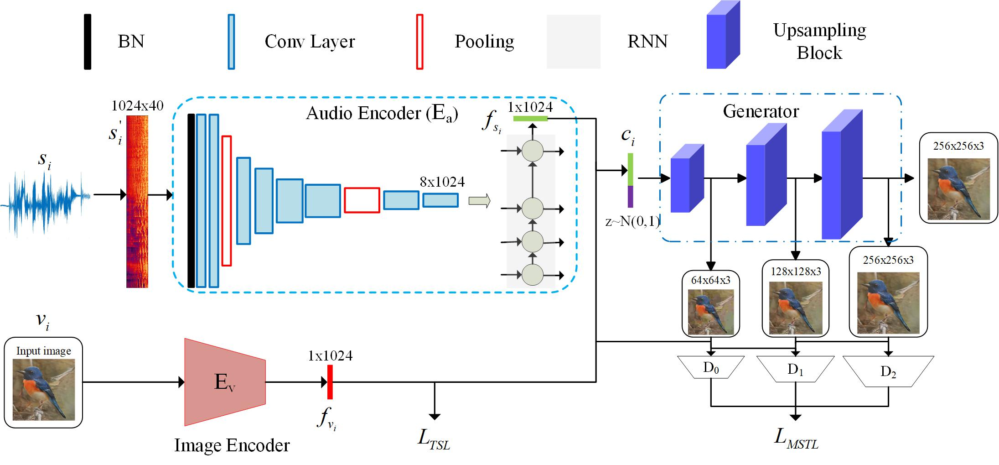

# Speech-to-Image Transaltion without Text

Our model aims to translate speech signals into image without the middle text representation. We use a speech encoder based CNN+RNN to extract an embedding feature from the input speech description and synthesize images with semantical consistancy by a stacked generator. 
This project provides the code for training the model and the method to evaluate the model on synthesized and real data.


**You can take a look about our resluts on our [speech-to-image](https://smallflyingpig.github.io/speech-to-image/main) project home page.**


# Cite us
If you use this code or part of it, please cite us!  
*Jiguo Li, Xinfeng Zhang, Chuanming Jia, Jizheng Xu, Li Zhang, Yue Wang, Siwei Ma, Wen Gao, "Speech-to-Image Translation without Text"* [arxiv(avaliable soon)]()


# Prerequisites
 - linux
 - python 3.5 (not test on other versions)
 - caffe(to extract the image feature)
 - pytorch 1.0+
 - librosa
 - json, tqdm, logging

# Update

# Training
Here we use CUB-200 as example and other datasets are similar to CUB-200.

## data preparing
### download CUB-200 dataset
 - Download [CUB-200](http://www.vision.caltech.edu/visipedia/CUB-200-2011.html) dataset and put it to "./data/birds"
 - Download the train/split file from our [speech-to-image](https://smallflyingpig.github.io/speech-to-image/main) project main page.


### prepare speech descriptions via Baidu TTS
 - Run 
```
python ./Audio_to_Image/text_to_speech.py --dataset birds --output_dir ./data/birds/CUB_200_2011_audio --APP_ID APP_ID --API_KEY API_KEY --SECRET_KEY SECRET_KEY
```
you can get APP_ID, API_KEY, SECRET_KEY from Baidu AI platform(free).
 - Or you can contact the author to get the data.
### prepare image features
 - Extract image feautures using caffe googlenet(see details in "./prepare_image_features.py") or download the image feature from our [speech-to-image](https://smallflyingpig.github.io/speech-to-image/main) project home page(recommend), then put the features for training into "./data/birds/train" and that for testing into "./data/birds/test".
  
### dictionary structure for data
```
-> tree ./data/birds -L 2
./data/birds
├── CUB_200_2011
├── CUB_200_2011_audio
│   └── audio
├── test
│   └── image_features_googlenet_caffe.pickle
├── test.json
├── train
│   └── image_features_googlenet_caffe.pickle
└── train.json
```
## training the speech encoder
In the project dictionary "speech-to-image-translation-without-text", run
```
export PYTHONPATH=$PYTHONPATH:$(pwd)
bash ./run_audio_encoder.sh 1 --output_dir ./output/Audio_to_Image/log/birds_speech_encoder --epoch 1000 --eval_every 10 --lr_scheduler_step_size 200 --lr_scheduler_gamma 0.5 --loss_diff 1 --loss_same 0.1 --l1_flag --jel_flag --lambda_l1 5 --distill_flag --lambda_distill 1000 --learning_rate 1e-3  --dataset birds --bidirectional
```
## extracting speech features
## training the generator

# evalution

